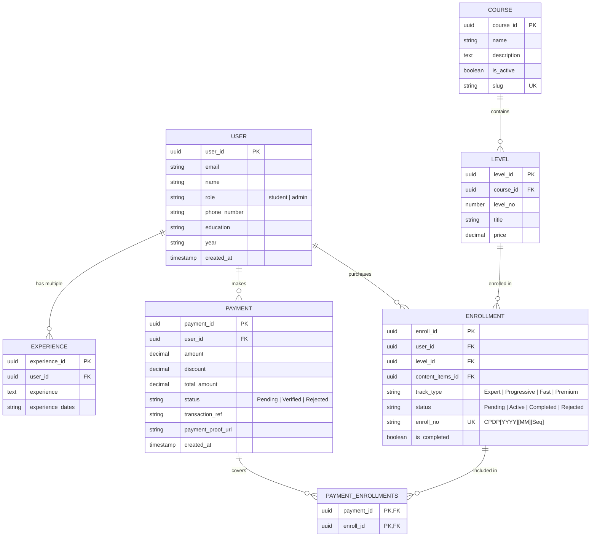

# IT-vate Solutions Platform - Comprehensive Agent Workflow & Architecture

**Project Name:** IT-vate Solutions Platform (Portfolio + LMS Monorepo)  
**Tech Stack:** Next.js 15+ (App Router), TypeScript, Supabase (Auth, PostgreSQL, Storage), Tailwind CSS v4, Shadcn UI, Lucide Icons  
**Primary Branding Palette:**  
- **Backgrounds:** Pure White (`#ffffff`)  
- **Headings / Nav / Footer / Sidebar:** Dull Navy Blue (`#0F172A` / `#1E293B`)  
- **Accents / CTAs / Active Selection:** Custom IT-vate Orange (`#F18231`)  

---

## 1. Architectural Strategy & Subdomain Routing

Instead of splitting into two separate Next.js projects (which causes code duplication and fragmented auth states), the platform is structured as a **unified App Router monorepo** utilizing **Route Groups** and **Middleware host routing**:

```
src/
├── app/
│   ├── (portfolio)/              # Domain 1: itvatesolutions.com
│   │   ├── page.tsx              # Home / Landing
│   │   ├── about/                # About Us
│   │   ├── services/             # Embedded Systems, IoT, etc.
│   │   ├── sustainability/       # Sustainability SDGs
│   │   ├── courses/              # Course Catalog
│   │   │   └── [slug]/           # Course Detail & 4-Track UI
│   │   └── checkout/             # Track Summary & Payment Submission
│   │
│   ├── (lms)/                    # Domain 2: lms.itvatesolutions.com
│   │   ├── dashboard/            # Student Dashboard & Track Progress
│   │   ├── certificates/         # Certificate View & Download
│   │   ├── discover/             # Internal Course Cross-Sell
│   │   └── admin/                # Admin Panel for Payment Verification
│   │
│   ├── layout.tsx                # Root Layout (Fonts, Supabase Provider)
│   └── globals.css               # Design System Variables & Tokens
│
├── components/                   # Shared UI (Shadcn + Custom)
├── lib/                          # Supabase Client, Auth Helpers, Utilities
└── middleware.ts                 # Host Header Domain Matcher & Auth Preserver
```

### Host-Based Domain Middleware (`middleware.ts`) Logic
1. Reads `request.headers.get('host')`.
2. If host starts with `lms.` or path matches LMS, rewrite to `/(lms)/...`.
3. If host is standard `itvatesolutions.com` or local root, rewrite to `/(portfolio)/...`.
4. Refreshes and synchronizes Supabase Auth cookies (`@supabase/ssr`) across root domain and subdomains so students never face re-login prompts.

---

## 2. Supabase Relational Database Schema



---

## 3. End-to-End User Workflows

### Workflow A: Course Selection & 4-Track System
1. Student browses `/(portfolio)/courses/[slug]`.
2. Student selects one of the 4 Tracks using Shadcn `RadioGroup` with custom orange (`#F18231`) active borders:
   - **Expert Track:** All levels unlocked simultaneously.
   - **Progressive Track:** Sequential level completion.
   - **Fast Track:** Custom level pick.
   - **Premium Track:** 1-on-1 personalized mentorship.
3. Pricing calculations update dynamically (base level pricing, track multipliers, coupon codes, final total).

### Workflow B: Authentication & Dynamic Onboarding
1. On checkout initiation, system verifies Supabase auth session.
2. If unauthenticated, redirects to `/signup` with standard inputs + dynamic multi-item **Work Experience** array fields.
3. Saves user details to `User` table and inserts experience array entries into `Experience` table.
4. Returns user directly to the payment page.

### Workflow C: Payment Proof Submission
1. Displays company bank details (Title, IBAN, Account No).
2. User submits Transaction Reference ID and uploads payment receipt screenshot.
3. System uploads screenshot to Supabase Storage bucket (`payment-proofs`).
4. Creates `Payment` record with status `Pending` and creates corresponding `Enrollment` record.
5. User is redirected to `/checkout/pending` ("Waiting for Admin Verification").

### Workflow D: Admin Approval & `CPDP` ID Generation
1. Admin logs into `/(lms)/admin`.
2. Data table lists `Pending` payments with preview links for transaction proofs.
3. Admin clicks **Approve**:
   - Executes Server Action / API route.
   - Updates `Payment.status` to `Verified` and `Enrollment.status` to `Active`.
   - Generates permanent Enrollment ID format: `CPDP[YYYY][MM][Sequential_No]` (e.g. `CPDP202607001`).
   - Triggers Google Classroom manual onboarding checklist for Admin.

### Workflow E: Student LMS & Dashboard
1. Student accesses `/(lms)/dashboard`.
2. Layout features Dull Navy Blue (`#0F172A`) Sidebar with 3 navigation sections:
   - **Dashboard Main:** Enrolled course cards, level progress bars, course material & Google Classroom links.
   - **Certificates:** Render/download completed level certificates.
   - **Discover Courses:** Internal catalog to upgrade tracks or enroll in new courses without leaving the LMS.

---

## 4. Multi-Phase Implementation Roadmap for Agents

### Phase 1: Environment & Core Setup (COMPLETED)
- [x] Next.js App Router initialization with TypeScript & Tailwind CSS v4.
- [x] Package installation (`@supabase/supabase-js`, `@supabase/ssr`, `lucide-react`, `clsx`, `tailwind-merge`).
- [x] Configure design tokens in `globals.css` (White, Dull Navy Blue `#0F172A`, Custom Orange `#F18231`).
- [x] Build verification via `npm run build`.

### Phase 2: Domain Middleware & Route Groups
- [ ] Create `src/app/(portfolio)` and `src/app/(lms)` route groups.
- [ ] Write `src/middleware.ts` for host header resolution and Supabase Auth cookie management.

### Phase 3: Supabase Integration & Auth Forms
- [ ] Set up Supabase Client helpers (`src/lib/supabase/client.ts` & `src/lib/supabase/server.ts`).
- [ ] Create Database Migration / SQL schema file for Supabase.
- [ ] Build Signup form with dynamic `Experience` array builder using Shadcn UI.

### Phase 4: Public Portfolio Pages & Course Track Selector
- [ ] Build Home, About, Services, Sustainability, and Contact pages.
- [ ] Build Course Catalog & Course Detail page.
- [ ] Build 4-Track selection radio UI with dynamic price calculator.

### Phase 5: Checkout, Bank Details & Manual Payment Upload
- [ ] Build `/checkout` page with track summary.
- [ ] Create payment proof file upload to Supabase Storage.
- [ ] Build `/checkout/pending` verification screen.

### Phase 6: Admin Dashboard & Server Action Approval
- [ ] Create Admin layout with protected role check (`User.role === 'admin'`).
- [ ] Build Pending Payments table with preview drawer.
- [ ] Implement approval action generating permanent `CPDP[YYYY][MM][Seq]` enrollment ID.

### Phase 7: Student LMS Dashboard & Polish
- [ ] Create LMS layout with Dull Navy Blue sidebar.
- [ ] Implement Enrolled Tracks main page with progress indicators.
- [ ] Implement Certificates & Discover Courses pages.
- [ ] Final UI review: strictly minimal carding, no emojis, light slate borders, generous whitespace.
